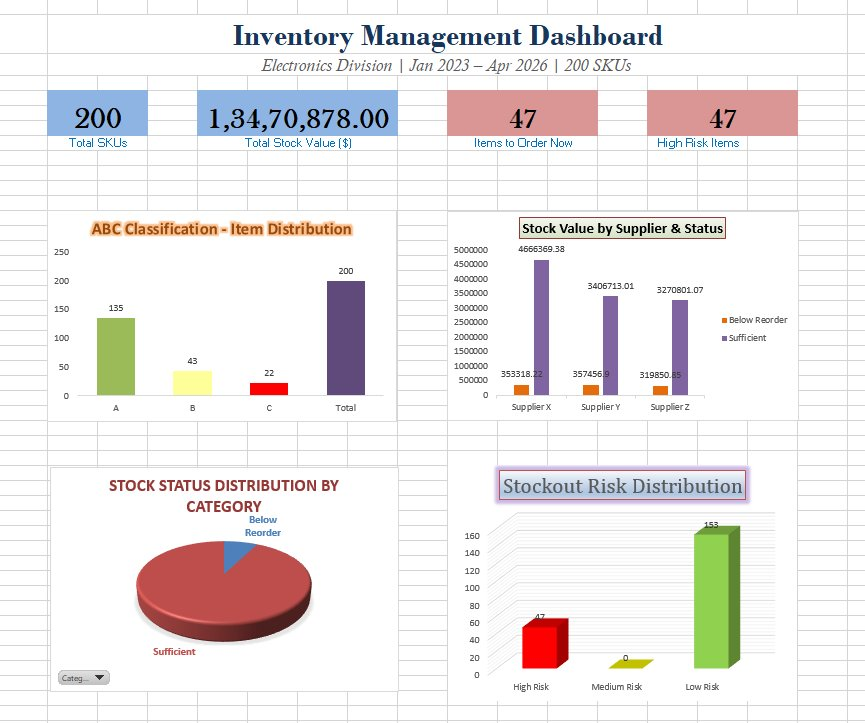
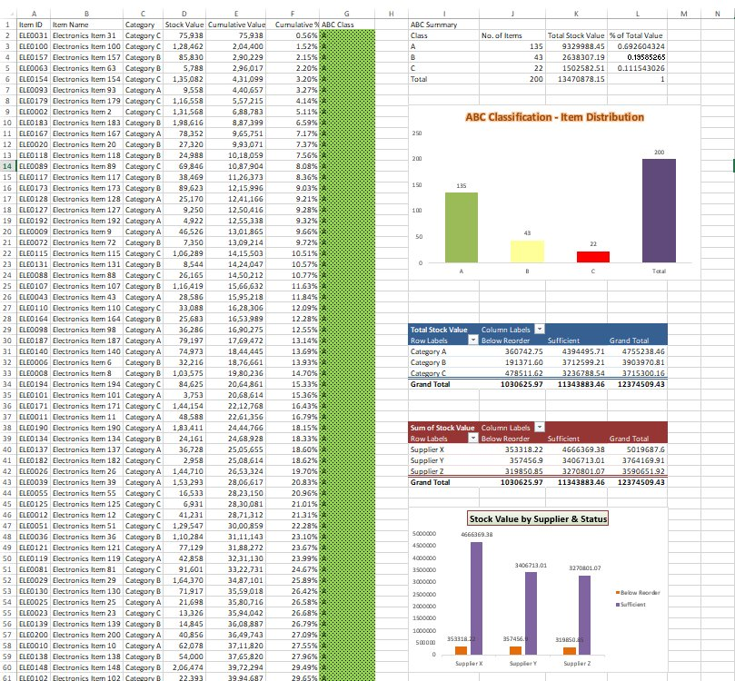
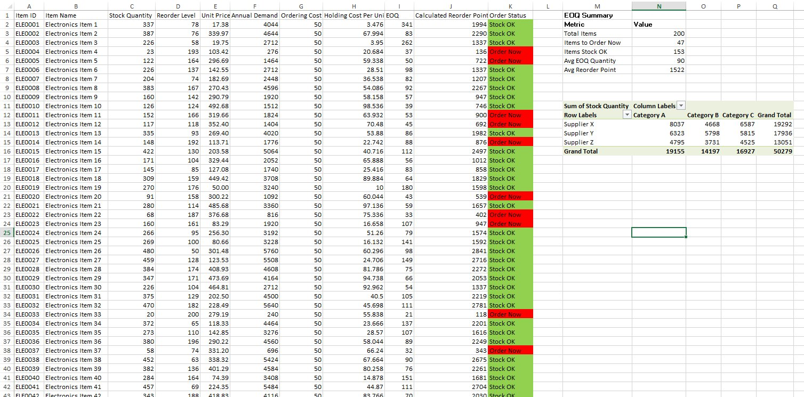
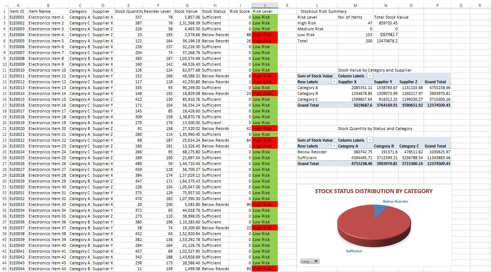

# Inventory Management & Optimization Analytics — Excel

## 📌 Project Overview

An end-to-end inventory analytics project built entirely in Microsoft Excel, analyzing **200 electronics SKUs** across a **3-year period (Jan 2023 – Apr 2026)**. The project answers critical operational questions around stock prioritization, cost optimization, and stockout prevention across 3 suppliers and 3 warehouses.

---

## 📸 Project Screenshots

### 🖥️ Dashboard


### 📊 ABC Analysis


### ⚙️ EOQ & Reorder


### ⚠️ Stockout Risk


---

## 🎯 Business Problems Solved

| # | Business Question | Analysis Used |
|---|---|---|
| 1 | Which products generate 70% of inventory value? | ABC Classification |
| 2 | What is the optimal order quantity to minimize cost? | EOQ Optimization |
| 3 | When exactly should each product be reordered? | Reorder Point Analysis |
| 4 | Which products are at immediate risk of stockout? | Stockout Risk Scoring |
| 5 | Which supplier holds the most at-risk inventory? | Pivot Table Analysis |
| 6 | What is the total capital tied up in inventory? | KPI Dashboard |

---

## 📁 Repository Structure

```
inventory-mgmt-abc-eoq-excel/
│
├── Inventory_Management_Project.xlsx    # Main project file (all 5 sheets)
├── dataset.xlsx                         # Raw dataset — 200 SKUs
├── screenshots/                         # Sheet screenshots
│   ├── dashboard.png
│   ├── abc_analysis.png
│   ├── eoq_reorder.png
│   └── stockout_risk.png
└── README.md
```

---

## 🗂️ Dataset Overview

| Field | Details |
|---|---|
| Total SKUs | 200 Electronics Items (ELE0001–ELE0200) |
| Time Period | January 2023 – April 2026 |
| Categories | Category A, B, C |
| Suppliers | Supplier X, Y, Z |
| Warehouses | Warehouse A, B, C |
| Key Fields | Stock Quantity, Reorder Level, Unit Price, Stock Value, Stock Status |

---

## 🔬 Analysis Breakdown

### 1. 📦 ABC Classification
- Ranked all 200 SKUs by Stock Value — highest to lowest
- Calculated Cumulative Value and Cumulative % using absolute cell references
- Classified every item into three priority tiers using nested IF formula:
  - **Class A** — Top 70% of total stock value → 135 items → Priority restocking
  - **Class B** — Next 20% of total stock value → 43 items → Monitor regularly
  - **Class C** — Bottom 10% of total stock value → 22 items → Low priority
- Summary table built with COUNTIF and SUMIF formulas
- Pivot Table 1: Stock Value by Category vs Stock Status
- Pivot Table 2: Stock Value by Supplier vs Stock Status + Pivot Chart

### 2. ⚙️ EOQ & Reorder Point Model
- Applied the **Wilson EOQ Formula**:

  ```
  EOQ = √(2 × Annual Demand × Ordering Cost) / Holding Cost
  ```

- Assumptions used:
  - Annual Demand = Stock Quantity × 12 (monthly turnover)
  - Ordering Cost = $50 per order (fixed)
  - Holding Cost = 20% of Unit Price per year
- Calculated **Reorder Point** = `(Annual Demand / 365) × 180 days lead time`
- Generated **Order Status** per SKU: `Order Now` vs `Stock OK`
- Summary metrics: Avg EOQ = 90 units | Avg Reorder Point = 1,522 units
- Pivot Table: Stock Quantity by Supplier and Category

### 3. ⚠️ Stockout Risk Scoring
- Built dynamic **Risk Score** formula:

  ```
  Risk Score = MAX(MIN(((Reorder Level − Stock Quantity) / Reorder Level × 100), 100), 0)
  ```

- Risk Classification:
  - 🔴 **High Risk** — Stock already below reorder level → **47 items**
  - 🟢 **Low Risk** — Stock comfortably above reorder level → **153 items**
- Pivot Table 1: Stock Value by Category and Supplier
- Pivot Table 2: Stock Quantity by Status and Category
- Pivot Chart: Stock Status Distribution by Category (Pie Chart)

### 4. 🖥️ KPI Dashboard
| KPI Card | Value |
|---|---|
| Total SKUs | 200 |
| Total Stock Value | ₹1,34,70,878 |
| Items to Order Now | 47 |
| High Risk Items | 47 |

- 4 charts: ABC Distribution \| Stock Value by Supplier \| Stock Status by Category \| Stockout Risk Distribution
- Professional layout — no gridlines, color-coded KPI cards, dark blue title

---

## 🛠️ Excel Techniques Used

| Technique | Where Used |
|---|---|
| `IF`, `Nested IF` | ABC Class, Order Status, Risk Level |
| `COUNTIF`, `SUMIF` | Summary tables across all sheets |
| `SQRT`, `ROUND`, `MAX`, `MIN` | EOQ formula, Risk Score capping |
| `Absolute References ($)` | Cumulative % calculation |
| **Pivot Tables** | ABC Analysis, EOQ, Stockout Risk |
| **Pivot Charts** | Supplier analysis, Stock status distribution |
| **Conditional Formatting** | Stock Status, ABC Class, Order Status, Risk Level |
| **Data Sorting** | ABC ranked analysis |
| **Auto Filter** | Data sheet navigation |
| **Freeze Panes** | Data sheet header lock |

---

## 📈 Key Findings

- **₹1.34 Cr** total stock value across 200 SKUs
- **135 items (67.5%)** classified as Class A — contribute 69.3% of total inventory value
- **47 items (23.5%)** require immediate reordering
- **47 items (23.5%)** flagged as High Risk stockout items
- **Supplier X** holds the highest total stock value at ₹50,19,687
- **Category A** dominates inventory with ₹47,55,238 in stock value
- Average EOQ of **90 units** minimizes combined ordering and holding costs

---

## 💼 Business Impact

- Identifies high-value SKUs for priority procurement budget allocation
- Reduces total inventory cost by calculating optimal order quantities per SKU
- Prevents revenue loss by flagging 47 at-risk items for immediate action
- Provides supplier-level visibility to support vendor negotiation decisions
- Enables warehouse-level stock monitoring across 3 locations

---

## 🚀 How to Use

1. Download `Inventory_Management_Project.xlsx`
2. Open in **Microsoft Excel 2016 or later**
3. Go to the **Dashboard** tab for a summary view
4. Explore individual sheets for detailed analysis
5. To refresh Pivot Tables after any data change:
   - Right-click any Pivot Table → click **Refresh**

---


